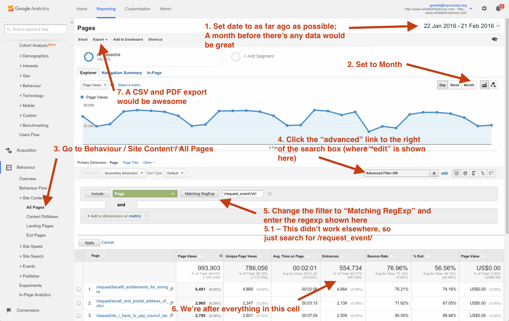

# Do Twitter bots increase traffic?

We had the [idea](https://github.com/mysociety/alaveteli/issues/2978#issue-125015926) of running Twitter accounts that tweet successful requests from the RSS feeds provided by Alaveteli.

- [issue#1](https://github.com/mysociety/alaveteli-experiments/issues/1)
- [issue#2](https://github.com/mysociety/alaveteli-experiments/issues/2)
- [issue#3](https://github.com/mysociety/alaveteli-experiments/issues/3)

## Answer

**TL;DR:** No.

Based on our current metrics, it doesn't seem like links posted through a Twitter bot account for any significant traffic.

## Analysis

The links tweeted are the Request events (rather than a direct link to the request) so we can look at URLs starting `/request_event/`. (Note the image below uses a Regexp, but that didn't seem to return any results for NZ).

### FYI NZ

[FYI NZ](https://twitter.com/OIA_NZ) already do this using [fyi-squeaker](https://github.com/wombleton/fyi-squeaker), so would be a good indicator of whether its worth pursing elsewhere. They have a substantial follower count (nearly 700 in April 2016) so its likely people are at least seeing the tweets.

Between January 2009 and February 2016 only **0.01%** of site traffic came from `/request_event/` URLs. For 2015 12% came from social media in general. Of that around 70% from Twitter (so 8% of the total).

- [Analytics fyi.org.nz Pages 20090124-20160223.csv](do-twitter-bots-increase-traffic/fyi-org-nz-twitter-bot-20090124-20160223.csv)

### KiMitTud (Hungary)

We've also set up [@Ki_Mit_Tud_Bot](https://twitter.com/Ki_Mit_Tud_Bot) to try the same in Hungary. We don't have enough data yet to know whether this has had any effect.

