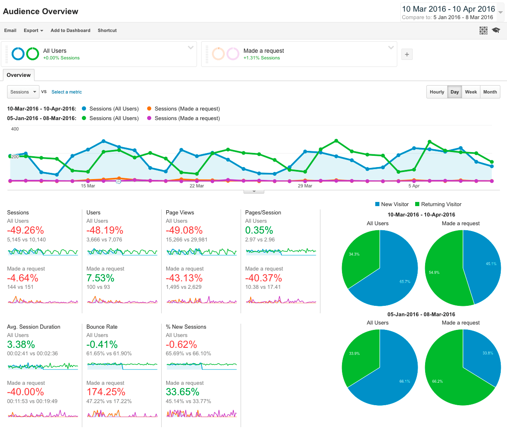

# Does the requirement to log in before starting the request process decrease conversions?

Alaveteli has a [configuration option](http://alaveteli.org/docs/customising/config/#force_registration_on_new_request) that forces users to create an account before they _start_ the make a request process. We've long recommended that administrators _don't_ enable this, but we've never had any data to illustrate the impact. [AskTheEU.org](http://asktheeu.org) recently removed this configuration setting, so we took a look at the conversion rate before and after.

- [issue#42](https://github.com/mysociety/alaveteli-experiments/issues/42)

## Answer

**TL;DR:** Yes. We continue to recommend that `FORCE_REGISTRATION_ON_NEW_REQUEST` is set to `false`.

The conversion rate increased by about 1.2% after removing the requirement to create an account before starting the request.

## Analysis

### Analytics Data

Conversion rate before and after the change of configuration:

| Before (2016-02-06 – 2016-03-08) | After (2016-03-10 – 2016-04-10) |
|----------------------------------|---------------------------------|
| 1.56% of sessions                | 2.80% of sessions               |
| 1.50% of users                   | 2.70% of users                  |

