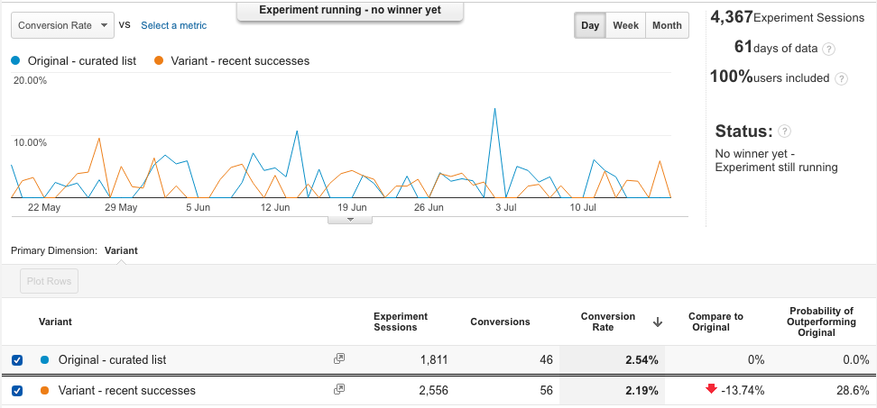

# Does an automatically generated list of recent successful requests result in more new requests than a curated set of 'top requests'?

Does showing recent successful requests on the homepage increase conversion rate?

- [issue#43](https://github.com/mysociety/alaveteli-experiments/issues/43)

## Answer

**TL;DR:** No.

The data from our A/B test shows there is no clear difference in the behaviour
of visitors who see the curated list and those who are shown recent successes.
The combination of [a low percentage of visitors starting at the homepage](what-proportion-of-users-enter-on-the-homepage.md) and the list being limited to 2 items may have been factors.

## Analysis

We set up an alternate version of the homepage which showed the 2 most recent
successful requests in place of the usual list of "top requests". We then used
Google Analytic's Experiment feature to randomly send users to either the
original page or our new one and kept an eye on the conversion rate (for new
requests being made) to see which page would do best.

After more than 60 days of collecting data without a clear winner emerging, we
concluded that there is no benefit to altering the list of requests.
