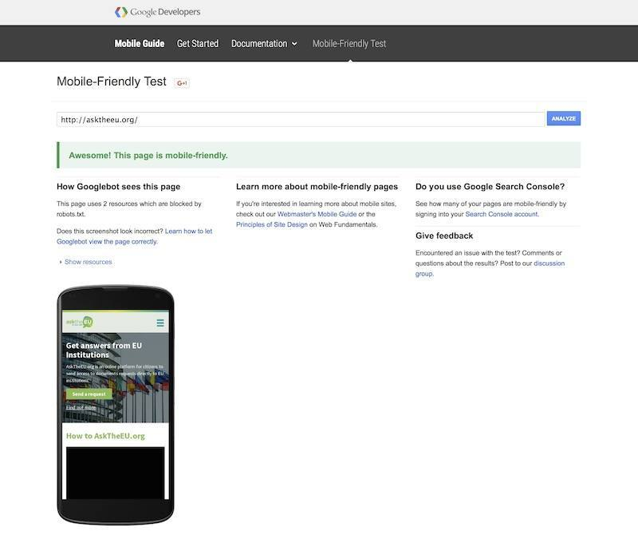
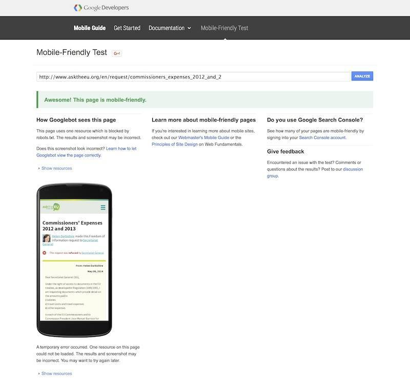
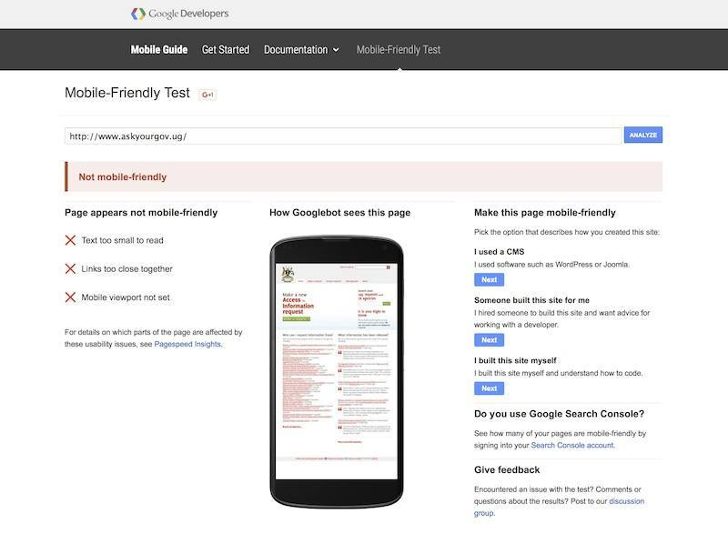
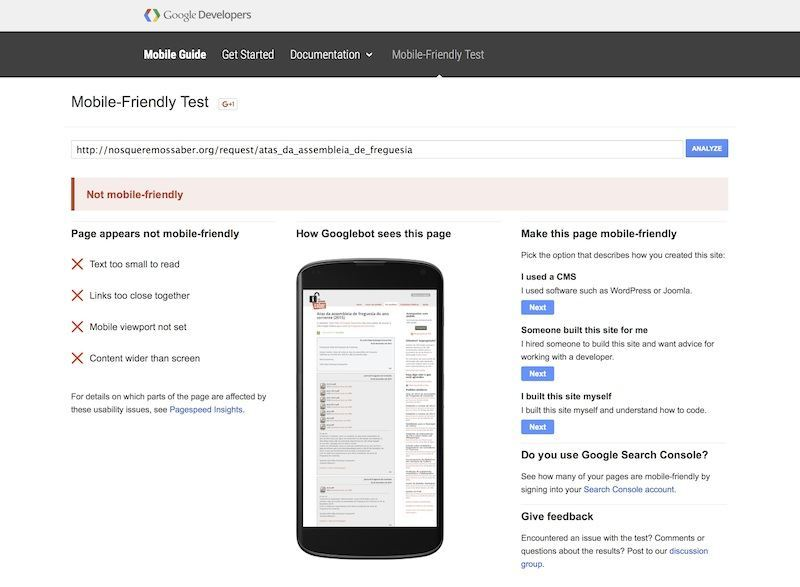

# Has upgrading AskTheEU.org to the responsive theme had an impact on usage numbers?

[AskTheEU.org](http://asktheeu.org) was [recently upgraded](https://www.mysociety.org/2016/01/26/a-new-look-for-asktheeu-org) to the latest version of the [responsive Alaveteli theme](https://github.com/mysociety/alavetelitheme). Does it look like the redesign has improved the general baseline analytics numbers?

- [issue#46](https://github.com/mysociety/alaveteli-experiments/issues/46)
- [Blog Announcement](https://www.mysociety.org/2016/01/26/a-new-look-for-asktheeu-org)

## Answer

**TL;DR:** Yes. Bounce rate has decreased across all devices. Google now considers the site "mobile friendly", which is said to improve search ranking.

Caveats: This is a comparison between the same period in 2015 vs 2016. Ideally we'd have run an A/B test over the first quarter of 2016.

## Analysis

### Analytics Data

<table>
  <thead>
    <tr>
      <th></th>
      <th>25th Jan – 11th March 2015</th>
      <th>25th Jan – 11th March 2016</th>
      <th>% Difference</th>
      <th>Result</th>
    </tr>
  </thead>
  <tbody>
    <tr>
      <th>Sessions (overall)</th>
      <td>7150</td>
      <td>7599</td>
      <td>+6.38%</td>
      <td><strong>Good:</strong> Increase in people coming to the site</td>
    </tr>
    <tr>
      <th>Bounce rate (overall)</th>
      <td>68.08%</td>
      <td>60.55%</td>
      <td>-11.07%</td>
      <td><strong>Good:</strong> Less people are leaving after not having interacted with the site at all</td>
    </tr>
    <tr>
      <th>Sessions (mobile)</th>
      <td>615</td>
      <td>765</td>
      <td>+24.39%</td>
      <td><strong>Good:</strong> More people using site on their mobiles</td>
    </tr>
    <tr>
      <th>Bounce rate (mobile)</th>
      <td>82.44%</td>
      <td>76.08%</td>
      <td>-7.72%</td>
      <td><strong>Good:</strong> Less people are leaving after not having interacted with the site at all</td>
    </tr>
    <tr>
      <th>Sessions (tablet)</th>
      <td>345</td>
      <td>327</td>
      <td>-5.44%</td>
      <td><strong>Decrease:</strong> Less people using site on their tablets</td>
    </tr>
    <tr>
      <th>Bounce rate (tablet)</th>
      <td>75.36%</td>
      <td>64.38%%</td>
      <td>-13.97%</td>
      <td><strong>Good:</strong> Less people are leaving after not having interacted with the site at all</td>
    </tr>
  </tbody>
</table>

### Mobile-friendly Test

The [homepage](https://www.google.co.uk/webmasters/tools/mobile-friendly/?url=asktheeu.org) and [request pages](https://www.google.co.uk/webmasters/tools/mobile-friendly/?url=http%3A%2F%2Fwww.asktheeu.org%2Fen%2Frequest%2Fcommissioners_expenses_2012_and_2) are considered mobile-friendly.

Sites using the older, non-responsive version of the theme are not considered mobile-friendly: [homepage](https://www.google.co.uk/webmasters/tools/mobile-friendly/?url=http%3A%2F%2Fwww.askyourgov.ug%2F), [request page](https://www.google.co.uk/webmasters/tools/mobile-friendly/?url=http%3A%2F%2Fnosqueremossaber.org%2Frequest%2Fatas_da_assembleia_de_freguesia).

