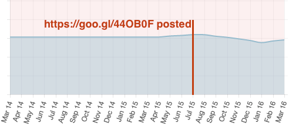
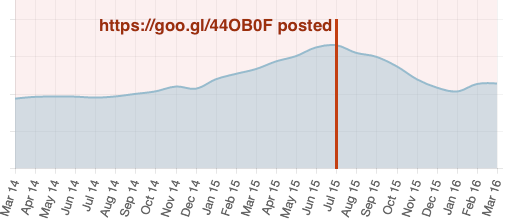

# Is an increase in FOI charges discouraging people from using KiMitTud?

In July 2016 the Hungarian government [announced](https://groups.google.com/forum/#!topic/alaveteli-users/CxS_sjsHj-Y) that the upper limit of costs was to be increased for FOI requests.

This announcement corresponded with a big dip in traffic and transactions to [KiMitTud](http://kimittud.atlatszo.hu).

- [issue#6](https://github.com/mysociety/alaveteli-experiments/issues/6)

## Answer

**TL;DR:** The perception of users might have changed, but the behaviour of authorities is unchanged.

## Analysis

Other than the downward trend in requests actually being made, it seems like the fees have made no impact on the quality of requests made on KiMitTud. If anything, these stats have improved.

I used the [article posted to alaveteli-dev](https://groups.google.com/forum/#!topic/alaveteli-users/CxS_sjsHj-Y) as a reference date for comparisons. The article was published on 2015-06-30, so I picked 2015-07-01 as the central point to go +/- 6 months either side.

The stats in mySociety’s internal tool ProjectDB show a downward trend in both traffic and transactions, although there is a slight uplift in the last month.

### Traffic

### Transactions

I counted the requests in different categories for the 6 month periods before and after the article’s publication.

<table>
  <thead>
    <tr>
      <th>Statistic</th>
      <th>Before (01/02/2015..01/07/2015)</th>
      <th>After (01/07/2015..01/01/2016)</th>
      <th>Sources</th>
    </tr>
  </thead>
  <tbody>
    <tr>
      <td>All requests</td>
      <td>2109</td>
      <td>2166</td>
      <td>
        <a href="http://goo.gl/sMmHbC">Before</a> 
        <a href="http://goo.gl/rey8lH">After</a>
      </td>
    </tr>
    <tr>
      <td>Successful requests</td>
      <td>1420</td>
      <td>1484</td>
      <td>
        <a href="http://goo.gl/chy3Gl">Before</a> 
        <a href="http://goo.gl/HC5saK">After</a>
      </td>
    </tr>
    <tr>
      <td>Unsuccessful requests</td>
      <td>312</td>
      <td>291</td>
      <td>
        <a href="http://goo.gl/V1EUYh">Before</a> 
        <a href="http://goo.gl/03Dkzl">After</a>
      </td>
    </tr>
    <tr>
      <td>Unresolved requests</td>
      <td>775</td>
      <td>836</td>
      <td>
        <a href="http://goo.gl/uo0L91">Before</a> 
        <a href="http://goo.gl/lgsUld">After</a>
      </td>
    </tr>
  </tbody>
</table>

In the 6 months after the article:

- Slightly more requests were made **(good)**
- Slightly more requests were marked as successful **(good)**
- Slightly less requests were marked as unsuccessful **(good)**
- More requests are still unresolved **(bad)**

Its hard to know why there are more unresolved requests. This search includes
unanswered requests and unclassified requests. Unanswered requests are bad, but un- classified may just mean that the user has not returned to classify the request. Some manual investigation could be performed here to look at the content of these requests to establish whether the authority is asking for a larger fee.

**Overall it looks like the behaviour of the authorities is largely unchanged**, and that the downward trend in request creation could be caused by the perception of KiMitTud users that requests will be unsuccessful. It was also mentioned that KiMitTud stopped doing workshops at some point during this time, so that could also be a reason for the dropoff in traffic and transactions.
