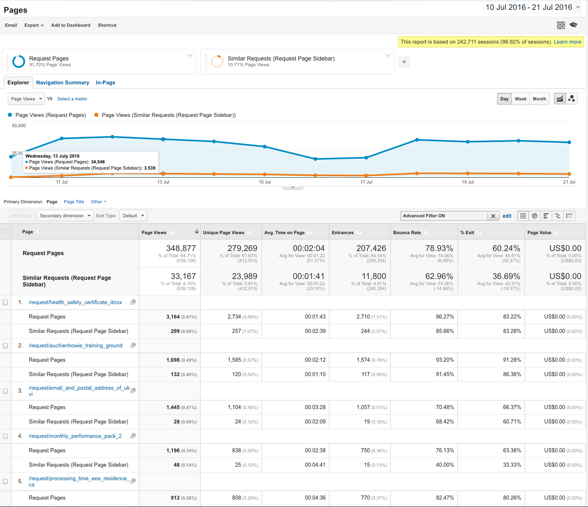
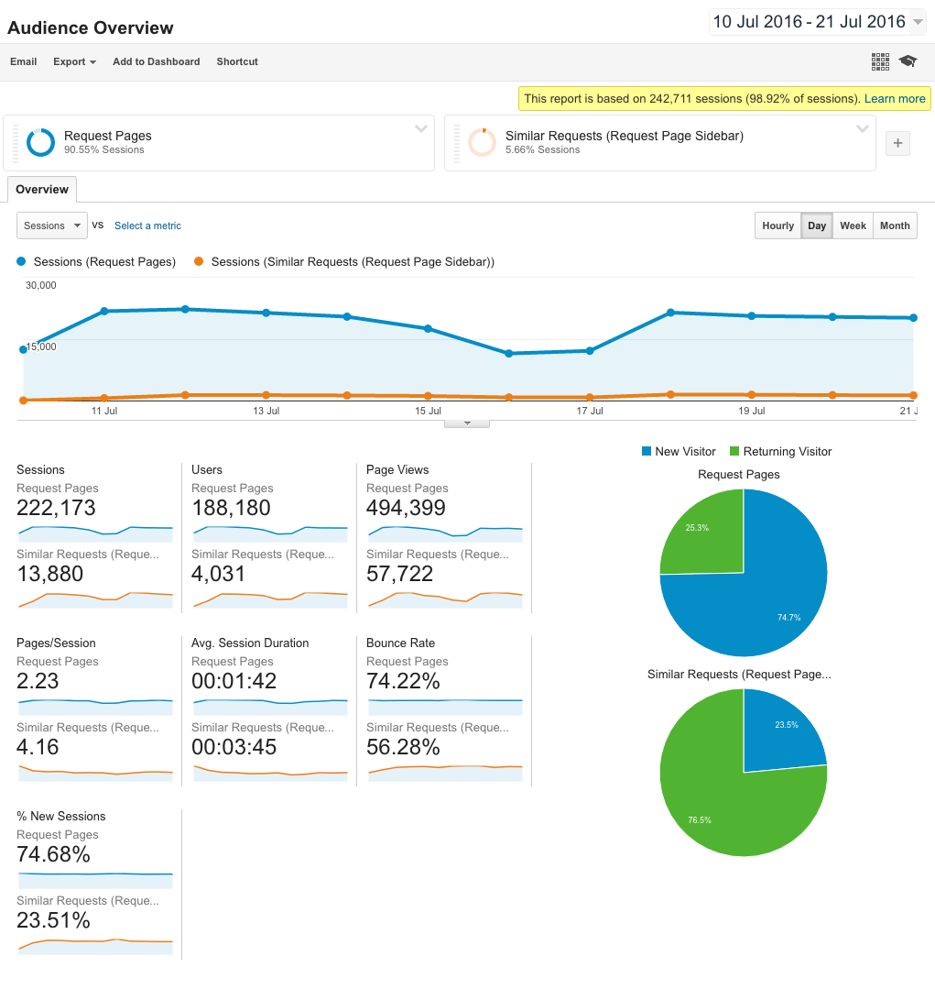

# Is the "similar requests" sidebar a valuable source of traffic?

Are the 'similar requests' in the sidebar of a request page used to navigate between requests?

- [issue#87](https://github.com/mysociety/alaveteli-experiments/issues/87)

## Answer

**TL;DR:** Yes; 10% of traffic to request pages is via the similar requests sidebar.

Visitors through the similar requests sidebar also spend double the time on site and view twice as many pages.

However, only 2% of users actually use the similar requests.

## Analysis

Data was gathered between 10 July 2016 and 21 July 2016 on [WhatDoTheyKnow](https://www.whatdotheyknow.com).

### Data

#### Similar Requests vs Request Pages Page Views

#### Similar Requests vs Request Pages Overview

